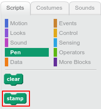
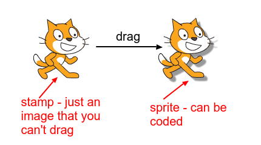
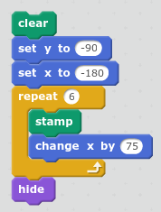
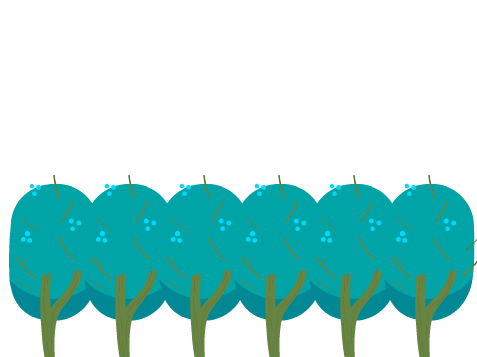

You can use `stamp`{:class="blockpen"} to draw a copy of a Scratch sprite's costume on the stage. 

+ Try clicking the `stamp`{:class="blockpen"} in the palette to create a copy of your sprite's costume.

+ Drag your sprite to see the copy. 

Here's a code example that creates a row of stamps and then hides the actual sprite:

You could use it to create a repeating background like this forest of trees:

You can't move or change the stamps with code, but you can use `clear`{:class="blockpen"} to remove them.
